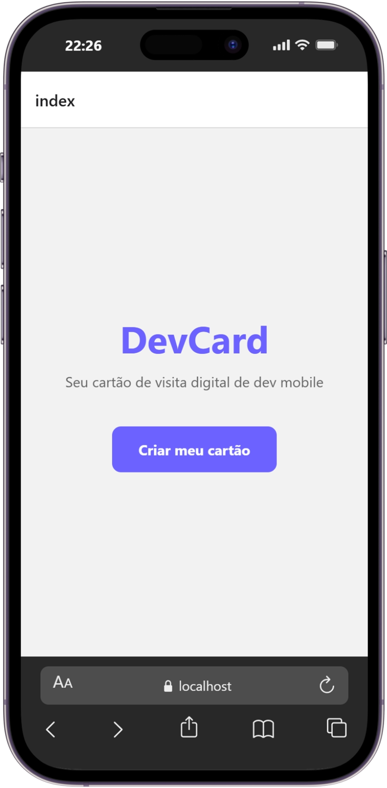
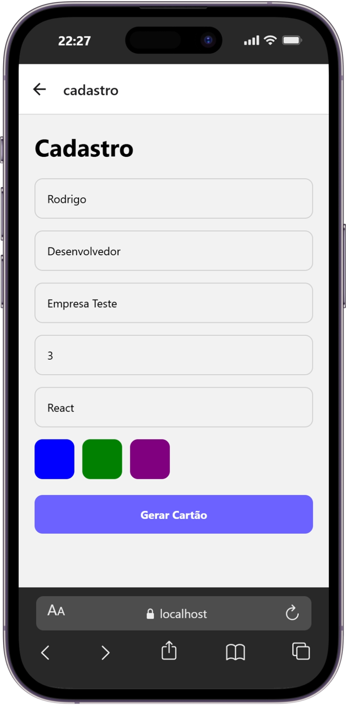
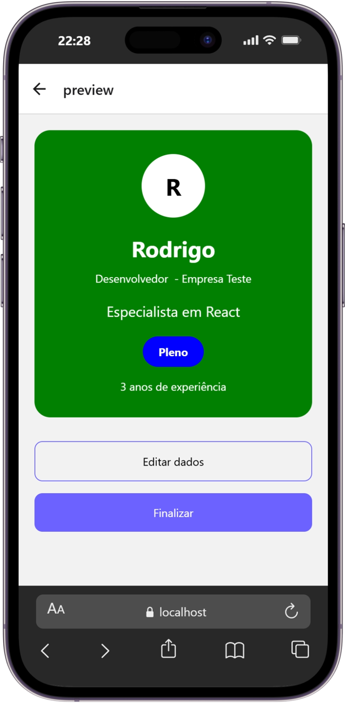

# DevCard

Aplicativo mobile desenvolvido em React Native utilizando Expo Router para a atividade prática da disciplina de Desenvolvimento Mobile.

O objetivo do projeto é permitir o cadastro de informações profissionais de um desenvolvedor e gerar um cartão de visita digital estilizado.

---

## Funcionalidades

- Tela inicial de apresentação
- Cadastro de desenvolvedor
- Validação de formulário
- Preview dinâmico do cartão
- Navegação entre telas utilizando Expo Router
- Tela de sucesso ao finalizar

---

## Tecnologias utilizadas

- React Native
- Expo
- Expo Router
- TypeScript

---

## Estrutura do projeto

```bash
src/
 └── app/
     ├── _layout.tsx
     ├── cadastro.tsx
     ├── index.tsx
     ├── preview.tsx
     └── sucesso.tsx
````
## Como executar o projeto

### 1. Clone o repositório

```bash
git clone https://github.com/Ro0dsS/Atividade-IA-2.1---Prof-Brendo-Vale.git
```

2. Acesse a pasta do projeto
```bash
cd devcard
```
4. Instale as dependências
```bash
npm install
```
6. Execute o projeto
```bash
npx expo start
```
# Imagens do projeto

## Tela Inicial



---

## Tela de Cadastro



---

## Tela Preview



---

## Tela de Sucesso


Navegação utilizada

O projeto utiliza os métodos de navegação do Expo Router:

router.push()
router.back()
router.replace()
